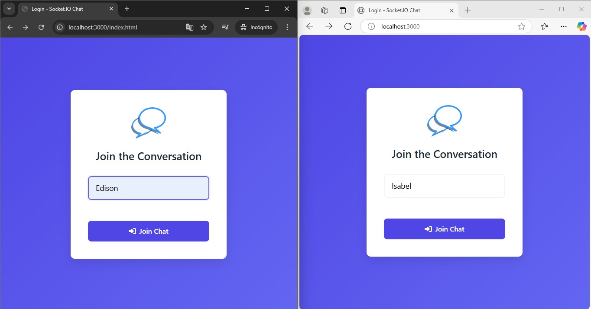

# **Real-Time Chat Application: NODE - SOCKET.IO**

[](https://nodejs.org/) 

---

## **Descripción**

Este proyecto es una aplicación de chat en tiempo real desarrollada con **Node.js** y **Socket.IO**. 

Con esta aplicación, los usuarios pueden:
- Enviar mensajes en tiempo real.
- Ver quién está escribiendo en el chat.
- Unirse a una sala de chat con un nombre de usuario único.
- Disfrutar de una interfaz visualmente atractiva y funcional.

## **Características principales**

- **Comunicación en tiempo real:** Gracias a **Socket.IO**, los mensajes se envían y reciben instantáneamente entre los usuarios conectados.
- **Interfaz elegante:** Diseño intuitivo que mejora la experiencia del usuario.
- **Notificaciones de escritura:** Los usuarios pueden ver quién está escribiendo en el chat.
- **Validación de nombres de usuario:** Asegura que cada usuario tenga un nombre único al unirse al chat.
- **Fácil de usar:** La aplicación es simple pero funcional, ideal para aprender o implementar en proyectos más grandes.


## **Tecnologías utilizadas**

- **Backend:** Node.js, Express.js, Socket.IO
- **Frontend:** HTML5, CSS3, JavaScript (jQuery)


## **Instalación y uso**

### **Requisitos previos**

- Node.js (v14 o superior)
- NPM (viene incluido con Node.js)

### **Pasos para ejecutar el proyecto**

1. **Clona el repositorio:**
   ```bash
   git clone https://github.com/tu-usuario/real-time-chat.git
   cd <TU_REPOSITORIO>
   ```

2. **Instala las dependencias:**
   ```bash
   npm init
   ```
   
3. **Inicia el servidor:**
   ```bash
   npm start
   ```
## **Funcionamiento de la aplicación**
 
*Ingresando con diferentes usuarios*


*Chateando en tiempo real*

## **Licencia**
Este proyecto está licenciado bajo la MIT License - consulta el archivo [LICENSE](LICENSE) para más detalles.

---

**Desarrollado por Edison Guaichico** - [Perfil de GitHub](https://github.com/EdisonGP)
